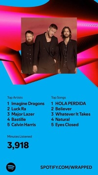

## **Mi Presentación**
***¡Hola mundo!***

### ***Sobre mi***
- Mi nombre es Raúl Arriestra
- Tengo 21 años
- Soy ___Técnico Informático___
- Vivo en Zárate
- Me apasiona la tecnología y la programación. En algún momento programé sitios web con **HTML**, **CSS** y algo de **JavaScript**; alguna aplicación con **Java**; y  gestionar bases de datos con **SQL**. Este último lenguaje me gustó mucho, y con ello lo que es relacionado a la gestión de DB.
- Me gusta aprender idiomas (**inglés** principalmente)

***

### ***Sobre mis estudios***:
- Este año estoy cursando las siguientes materias de 2° año:
    - Análisis Matemático II
    - Física II
    - Arquitectura de Computadoras
    - Análisis de Sistemas de Información
    - Inglés II
    - Sintaxis y Semántica de los Lenguajes
    - Probabilidad y Estadística
    - Paradigmas de la programación

  #### **Como objetivos profesionales y académicos destaco**:
    1. Terminar la carrera en lo posible en tiempo y forma
    2. Conseguir trabajo antes de terminar la carrera
    3. Trabajar en algún emprendimiento personal o para alguna empresa en la que esté interesado (todavía no lo tengo decidido a esto)

---
### **Otros datos sobre mí**:
> Estoy terminando de ver la última temporada de Fear The Walking Dead. Me encanta el universo de The Walking Dead. 🧟‍♂️

> Color favorito: Verde 🟢

> Mis gustos musicales: variados de todo un poco. Les adjunto foto de mi ranking de Spotify 2024.

Les dejo la lista de artistas y canciones que más escuché en el año 2024

